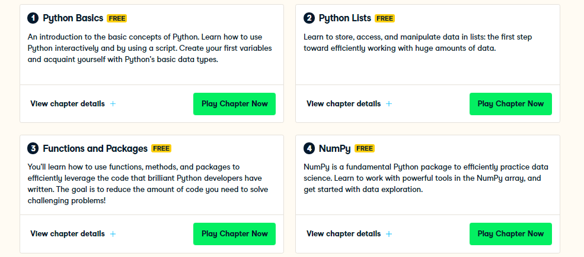

# Curso-de-Introduction-to-Python-de-Datacamp
Curso de Introduction to Python de Datacamp

## Link de acceso al curso: 

https://www.datacamp.com/courses/intro-to-python-for-data-science

Las empresas de todo el mundo están utilizando Python para descubrir insights de sus datos y obtener una ventaja competitiva. A diferencia de otros tutoriales de Python, este curso se centra en Python específicamente para la ciencia de datos. En nuestro curso de Introducción a Python, aprenderá acerca de formas poderosas de almacenar y manipular datos y herramientas útiles de ciencia de datos para comenzar a realizar sus propios análisis.

## Contenido del curso

